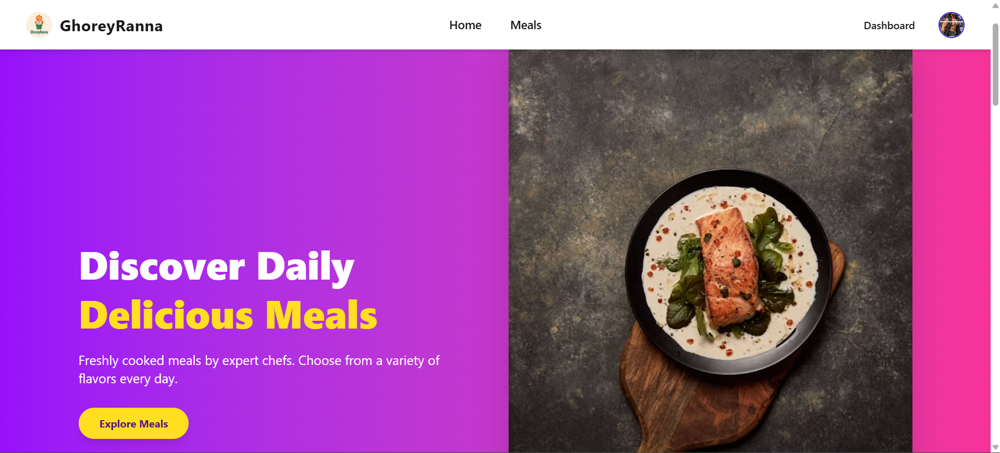

🍽️ GhoreyRanna

GhoreyRanna is a full-stack MERN marketplace platform that connects local home chefs with customers who want fresh, homemade meals.
Customers can browse daily meals, place orders, make secure payments, track order status, leave reviews, and manage favorites — while chefs and admins manage the platform through role-based dashboards.

🎯 Project Purpose

The purpose of GhoreyRanna is to:

Empower local home cooks to earn by selling homemade food

Provide customers with healthy, affordable, and fresh meals

Demonstrate full-stack development skills using the MERN stack

Implement role-based access control, secure authentication, and real-world features like payments, reviews, and dashboards

This project was built as part of B12-A11 (Category-15) assignment requirements.

🌐 Live Website

🔗 Live Client URL:
👉 https://regal-cobbler-c7d50a.netlify.app

🔗 Server URL:
👉 https://cooking-app-server.vercel.app


## 🔗 Source Code
- Client Repository: https://github.com/TanvirReza1/cooking-app.git
- Server Repository: https://github.com/TanvirReza1/cooking-app-server.git

## 🖼️ Screenshot



🧩 Key Features
🔑 Authentication & Security

Firebase Authentication (Email & Password)

JWT-based secure API access

Role-based access control (Admin / Chef / User)

Protected routes with persistent login on reload

Environment variables for Firebase & MongoDB credentials

🏠 Public Features

Animated Hero Section (Framer Motion)

Dynamic Daily Meals (6 items on Home)

Meals page with:

Pagination (10 meals per page)

Price sorting (Ascending / Descending)

Meal details page with:

Full meal info

Reviews

Favorite button

Responsive design for mobile & desktop

Dynamic browser title for every route

Custom Error Page & Global Loading Spinner

👤 User Dashboard

My Profile

My Orders

My Reviews (Update & Delete)

Favorite Meals

Secure Stripe payment integration

Payment history & receipt page

👨‍🍳 Chef Dashboard

Create Meal (Image upload required)

My Meals (Update & Delete)

Order Requests:

Accept

Cancel

Deliver

Live order status updates

🛠️ Admin Dashboard

Manage Users

Make Fraud / Block Users

Manage Role Requests (Chef / Admin)

Platform Statistics (Charts with Recharts)

Approve / Reject role requests

🧠 Technologies Used
Frontend

React 19

React Router DOM

Tailwind CSS

DaisyUI

Framer Motion

React Hook Form

TanStack React Query

Axios (with interceptors)

SweetAlert2

Recharts

Swiper

Firebase Authentication

Backend

Node.js

Express.js

MongoDB

Firebase Admin SDK

JWT Authentication

Stripe Payment Gateway

CORS & Security Middleware

---

## 🚀 How to Run the Project Locally

### 1️⃣ Run Client Side
```bash
git clone https://github.com/TanvirReza1/cooking-app.git
cd cooking-app
npm install
npm run dev


2️⃣ Run Server Side
git clone https://github.com/TanvirReza1/cooking-app-server.git
cd cooking-app-server
npm install
npm run start


3️⃣ Environment Variables
Create .env files for both client and server.

Client Side (.env)
VITE_FIREBASE_API_KEY=your_key
VITE_FIREBASE_AUTH_DOMAIN=your_domain
VITE_FIREBASE_PROJECT_ID=your_project_id
VITE_FIREBASE_STORAGE_BUCKET=your_bucket
VITE_FIREBASE_MESSAGING_SENDER_ID=your_sender_id
VITE_FIREBASE_APP_ID=your_app_id
VITE_BACKEND_URL=your_backend_url

Server Side (.env)
MONGODB_URI=your_mongodb_uri
JWT_SECRET=your_jwt_secret
STRIPE_SECRET_KEY=your_stripe_key
FIREBASE_SERVICE_ACCOUNT=your_base64_service_account


## 📦 Dependencies Used

### Client Side
- react
- react-dom
- react-router-dom
- tailwindcss
- daisyui
- framer-motion
- react-hook-form
- @tanstack/react-query
- axios
- sweetalert2
- recharts
- swiper
- firebase
```
### Server Side
```
- express
- mongodb
- cors
- dotenv
- jsonwebtoken
- stripe
- firebase-admin
